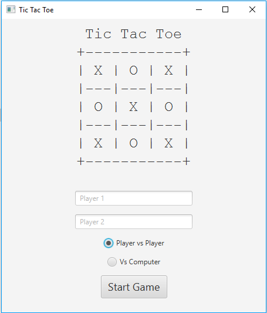
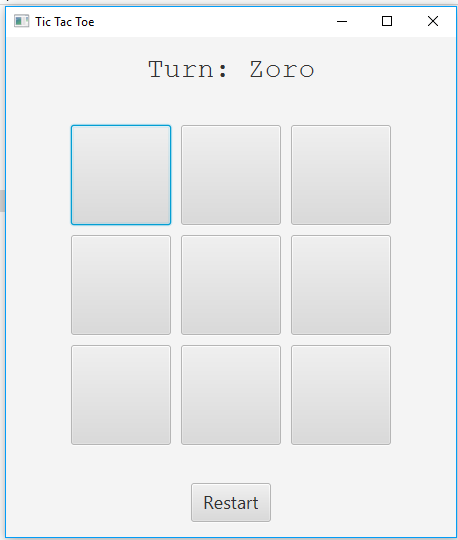
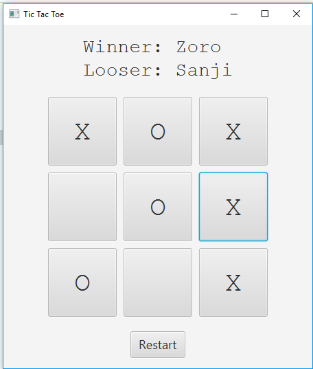
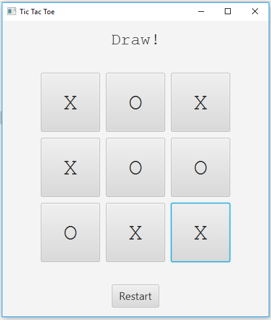
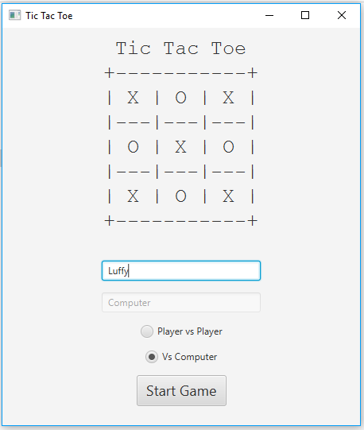

# ❌⭕ Tic Tac Toe Game using JavaFX


A desktop-based Tic Tac Toe game developed using JavaFX in Java 8.  
The application supports both **Player vs Player** and **Player vs Computer** modes with restart functionality and simple AI-based computer moves.

---

## ✨ Features

- 🎮 Player vs Player mode
- 🤖 Player vs Computer mode
- 🔁 Restart game functionality
- 👤 Custom player names
- 🧠 Random AI computer moves
- 🏆 Winner and draw detection
- 🖥️ JavaFX-based GUI
- 📦 Runnable JAR support

---

## 🛠️ Technologies Used

- Java 8
- JavaFX
- Eclipse / STS
- OOP Concepts

---

## 📂 Project Structure

```text
src
└── ticTacToe
    ├── launcher
    │   └── GameLauncher.java
    ├── model
    │   └── GameLogic.java
    └── ui
        └── TicTacToeUI.java
```

---

## ▶️ How to Run

### Option 1 — Run using IDE

1. Open project in Eclipse / STS
2. Run `GameLauncher.java`

---

### Option 2 — Run exported JAR

Make sure Java 8 or higher is installed.

```bash
java -jar TicTacToe.jar
```

---

### Option 3 — Run using batch file (Windows)

Double click:

```text
run.bat
```

---

## 📸 Screenshots

### Home Screen



### Gameplay Screen



### Conclusion Screen



### Draw Screen



### Computer Mode



---

## 🧠 Concepts Practiced

- JavaFX GUI development
- Event handling
- Object-Oriented Programming
- Arrays and loops
- Game state management
- Separation of concerns
- Basic AI logic

